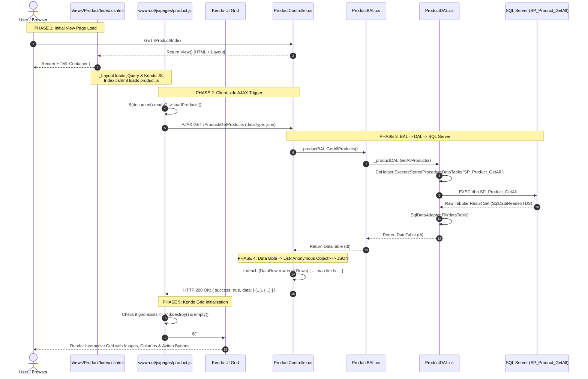

# Deep Architecture & Data Flow Analysis: Product Module

Is document me **ShopManagement** project ke Product module ka starting page load se lekar Database query execution, DataTable se JSON conversion, aur Kendo UI Grid rendering tak ka pura **End-to-End Deep Flow** explain kiya gaya hai.

---

## 1. High-Level Architecture Overview & Deep Flowchart

Product module **3-Tier / N-Tier Architecture** follow karta hai:

```mermaid
flowchart TD
    classDef client fill:#1e293b,stroke:#38bdf8,stroke-width:2px,color:#f8fafc;
    classDef web fill:#0f172a,stroke:#818cf8,stroke-width:2px,color:#f8fafc;
    classDef bal fill:#1e1b4b,stroke:#c084fc,stroke-width:2px,color:#f8fafc;
    classDef dal fill:#064e3b,stroke:#34d399,stroke-width:2px,color:#f8fafc;
    classDef db fill:#451a03,stroke:#fb923c,stroke-width:2px,color:#f8fafc;
    classDef trans fill:#701a75,stroke:#f472b6,stroke-width:2px,color:#f8fafc;

    subgraph CLIENT["1. Client Browser Tier"]
        direction TB
        B1["🌐 Browser Navigates: GET /Product/Index"]:::client
        B2["📄 Views/Product/Index.cshtml (DOM & Container #productGrid)"]:::client
        B3["⚙️ wwwroot/js/pages/product.js (loadProducts)"]:::client
        B4["📊 Kendo UI Grid ($('#productGrid').kendoGrid)"]:::client
    end

    subgraph WEBSERVER["2. ASP.NET Core Web Server Tier"]
        direction TB
        C1["🎮 ProductController.Index() -> returns View()"]:::web
        C2["🎮 ProductController.GetProducts() [HttpGet]"]:::web
        C3["🔄 DataRow to JSON Mapping Loop (foreach DataRow)"]:::trans
        C4["📦 JsonResult: { success: true, data: List&lt;object&gt; }"]:::web
    end

    subgraph BUSINESS["3. Business Access Layer (BAL)"]
        direction TB
        BAL1["💼 ProductBAL.GetAllProducts()"]:::bal
    end

    subgraph DATAACCESS["4. Data Access Layer (DAL) & ADO.NET Helper"]
        direction TB
        DAL1["💾 ProductDAL.GetAllProducts()"]:::dal
        DAL2["🛠️ DbHelper.ExecuteStoredProcedureDataTable()"]:::dal
        DAL3["🔌 SqlConnection & SqlCommand ('SP_Product_GetAll')"]:::dal
        DAL4["📥 SqlDataAdapter.Fill(DataTable dataTable)"]:::dal
    end

    subgraph DATABASE["5. Database Engine (SQL Server)"]
        direction TB
        DB1["⚡ Stored Procedure: dbo.SP_Product_GetAll"]:::db
        DB2["🗄️ Physical Table: dbo.Products (WHERE IsActive = 1)"]:::db
    end

    %% Execution Path (Request Downwards)
    B1 -->|1. Initial Load| C1
    C1 -->|2. Renders HTML| B2
    B2 -->|3. Loads script| B3
    B3 -->|4. AJAX GET /Product/GetProducts| C2
    C2 -->|5. Method Call: _productBAL.GetAllProducts()| BAL1
    BAL1 -->|6. Method Call: _productDAL.GetAllProducts()| DAL1
    DAL1 -->|7. Calls Helper| DAL2
    DAL2 -->|8. Prepares Connection & Command| DAL3
    DAL3 -->|9. EXEC SP_Product_GetAll| DB1
    DB1 -->|10. Filter Active Rows| DB2

    %% Return Path (Response Upwards with Data Transformation)
    DB2 -.->|11. Raw Result Set (TDS Protocol)| DAL4
    DAL4 -.->|12. In-Memory System.Data.DataTable| DAL1
    DAL1 -.->|13. Returns DataTable| BAL1
    BAL1 -.->|14. Returns DataTable| C2
    C2 -.->|15. Passes DataTable to| C3
    C3 -.->|16. Serializes into| C4
    C4 -.->|17. HTTP 200 JSON Response Payload| B3
    B3 -.->|18. Binds response.data to DataSource| B4
    B4 -.->|19. Injects dynamic &lt;tr&gt;/&lt;td&gt; into DOM| B2
```

---

## 2. End-to-End Sequence Diagram (Mermaid)


Neeche sequence diagram me dekhein ki Browser se lekar Database tak request kaise travel karti hai aur response wapas kaise render hota hai:



---

## 3. Step-by-Step Deep Dive with Exact Code Snippets

### Step 1: Initial Page Load (`Views/Product/Index.cshtml` & `_Layout.cshtml`)

1. User browser me `/Product/Index` par visit karta hai.
2. `_Layout.cshtml` ke head tag me **Kendo CSS** load hota hai:
   ```html
   <link rel="stylesheet" href="https://kendo.cdn.telerik.com/2024.1.130/styles/kendo.default-ocean-blue.min.css" />
   ```
3. `Index.cshtml` ka body render hota hai:
   ```html
   <div class="grid-card">
       @Html.AntiForgeryToken()
       <div id="productGrid"></div> <!-- Kendo Grid target container -->
   </div>
   ```
4. `_Layout.cshtml` ke bottom me **jQuery**, **Kendo JS**, aur **product.js** sequentially load hote hain:
   ```html
   <script src="https://code.jquery.com/jquery-3.7.1.min.js"></script>
   <script src="https://kendo.cdn.telerik.com/2024.1.130/js/kendo.all.min.js"></script>
   <!-- In Index.cshtml @section Scripts -->
   <script src="~/js/pages/product.js" asp-append-version="true"></script>
   ```

---

### Step 2: AJAX Trigger in `product.js`

Jaise hi DOM ready hota hai, `product.js` execution start karta hai:

```javascript
// File: wwwroot/js/pages/product.js
$(document).ready(function () {

    loadProducts(); // Call function on page load

    function loadProducts() {
        $.ajax({
            url: "/Product/GetProducts",
            type: "GET",
            dataType: "json",
            success: function (response) {
                // Response handling (Step 8)
            },
            error: function (xhr) {
                console.error("GetProducts error:", xhr.responseText);
            }
        });
    }
});
```

---

### Step 3: Controller Action (`ProductController.cs`)

Request ASP.NET Core Routing ke through `ProductController.GetProducts()` action method par aati hai:

```csharp
// File: ShopManagement/Controllers/ProductController.cs
[HttpGet]
public IActionResult GetProducts()
{
    try
    {
        // Step A: BAL ko call kiya
        DataTable dt = _productBAL.GetAllProducts();

        // Step B: DataTable Rows ko strongly typed anonymous objects me convert kiya
        var products = new List<object>();

        foreach (DataRow row in dt.Rows)
        {
            products.Add(new
            {
                productId   = Convert.ToInt32(row["ProductId"]),
                productCode = row["ProductCode"] == DBNull.Value ? "" : row["ProductCode"].ToString(),
                productName = row["ProductName"] == DBNull.Value ? "" : row["ProductName"].ToString(),
                quantity    = row["Quantity"] == DBNull.Value ? 0 : Convert.ToInt32(row["Quantity"]),
                price       = row["Price"] == DBNull.Value ? 0 : Convert.ToDecimal(row["Price"]),
                imagePath   = row["ImagePath"] == DBNull.Value ? "" : row["ImagePath"].ToString(),
                isActive    = row["IsActive"] != DBNull.Value && Convert.ToBoolean(row["IsActive"])
            });
        }

        // Step C: JSON format me return kiya
        return Json(new
        {
            success = true,
            data = products
        });
    }
    catch (Exception ex)
    {
        return StatusCode(500, new { success = false, message = ex.Message });
    }
}
```

---

### Step 4: Business Access Layer (`ProductBAL.cs`)

Controller aur Database ke beech BAL validation aur business decisions handle karta hai:

```csharp
// File: ShopManagement.Business/ProductBAL.cs
public class ProductBAL
{
    private readonly ProductDAL _productDAL;

    public ProductBAL(ProductDAL productDAL)
    {
        _productDAL = productDAL;
    }

    public DataTable GetAllProducts()
    {
        // Business Layer DAL se data request karta hai
        return _productDAL.GetAllProducts();
    }
}
```

---

### Step 5: Data Access Layer (`ProductDAL.cs`) & `DbHelper.cs`

DAL direct database communication ke liye SQL parameters aur procedure names assign karta hai:

```csharp
// File: ShopManagement.DataAccess/ProductDAL.cs
public class ProductDAL
{
    private readonly DbHelper _dbHelper;

    public ProductDAL(DbHelper dbHelper)
    {
        _dbHelper = dbHelper;
    }

    public DataTable GetAllProducts()
    {
        // Stored procedure trigger kiya bina parameters ke
        return _dbHelper.ExecuteStoredProcedureDataTable(
            "SP_Product_GetAll",
            Array.Empty<SqlParameter>()
        );
    }
}
```

#### Under the Hood in `DbHelper.cs`:
```csharp
// File: ShopManagement.DataAccess/DbHelper.cs
public DataTable ExecuteStoredProcedureDataTable(
    string procedureName,
    params SqlParameter[] parameters)
{
    using SqlConnection connection = _connectionFactory.CreateConnection();
    using SqlCommand command = new SqlCommand(procedureName, connection);
    command.CommandType = CommandType.StoredProcedure;

    if (parameters != null && parameters.Length > 0)
    {
        command.Parameters.AddRange(parameters);
    }

    // SqlDataAdapter connection open karta hai aur DataTable fill karta hai
    using SqlDataAdapter adapter = new SqlDataAdapter(command);
    DataTable dataTable = new DataTable();
    adapter.Fill(dataTable);

    return dataTable; // Disconnect mode me DataTable memory me return hoti hai
}
```

---

### Step 6: SQL Server Stored Procedure (`SP_Product_GetAll`)

Database engine ke andar execution plan run hota hai aur sirf active products fetch hote hain:

```sql
-- Stored Procedure: dbo.SP_Product_GetAll
CREATE OR ALTER PROCEDURE dbo.SP_Product_GetAll
AS
BEGIN
    SET NOCOUNT ON;

    SELECT
        ProductId, 
        ProductCode, 
        ProductName,
        Quantity, 
        Price, 
        ImagePath,
        IsActive, 
        CreatedDate, 
        UpdatedDate
    FROM dbo.Products
    WHERE IsActive = 1           -- Soft-deleted items filter out
    ORDER BY ProductId DESC;     -- Latest products first
END;
```

---

### Step 7: How DataTable Transforms into JSON (The Bridge)

Ye process sabse critical hai jo SQL database ke raw tabular result ko browser ke Kendo UI Grid ke JSON data format me transform karta hai:

```mermaid
flowchart TD
    classDef sql fill:#451a03,stroke:#fb923c,stroke-width:2px,color:#f8fafc;
    classDef ado fill:#064e3b,stroke:#34d399,stroke-width:2px,color:#f8fafc;
    classDef csharp fill:#1e1b4b,stroke:#818cf8,stroke-width:2px,color:#f8fafc;
    classDef json fill:#701a75,stroke:#f472b6,stroke-width:2px,color:#f8fafc;
    classDef kendo fill:#1e293b,stroke:#38bdf8,stroke-width:2px,color:#f8fafc;

    S1["🗄️ SQL Server: Products Table<br/><b>Row Format</b>: Binary Data on Disk / Buffer Cache"]:::sql
    -->|TDS Protocol over TCP| S2["🔌 ADO.NET SqlDataReader<br/>Stream of column data"]:::ado
    -->|SqlDataAdapter.Fill()| S3["📋 System.Data.DataTable<br/><b>dt.Rows</b>: In-Memory rows of boxed System.Object<br/><i>row['ProductId'], row['Price']</i>"]:::ado
    -->|Controller foreach (DataRow row in dt.Rows)| S4["⚙️ C# Anonymous Object Mapping<br/><b>Convert.ToInt32</b>(row['ProductId'])<br/><b>DBNull.Value Check</b>: row['Price'] == DBNull.Value ? 0 : Convert.ToDecimal(...)"]:::csharp
    -->|System.Text.Json Serializer| S5["📦 HTTP JSON Payload (Wire format)<br/><b>ContentType</b>: application/json<br/><code>{ 'success': true, 'data': [ { 'productId': 1, ... } ] }</code>"]:::json
    -->|jQuery AJAX response callback| S6["🌐 JavaScript In-Memory Object<br/><code>response.data</code> (Array of JS Objects)"]:::kendo
    -->|kendoGrid({ dataSource: { data: response.data } })| S7["📊 Kendo UI ObservableArray & DOM<br/>Injected into <code>&lt;tbody&gt;&lt;tr&gt;&lt;td&gt;...&lt;/td&gt;&lt;/tr&gt;&lt;/tbody&gt;</code>"]:::kendo
```

#### Detailed Transformation Comparison Table:

| Level | Data Representation | Type / Container | Code Responsible |
|---|---|---|---|
| **1. Database** | `1, 'P001', 'Laptop', 10, 45000.00, 1` | SQL Row (T-SQL) | `dbo.SP_Product_GetAll` |
| **2. ADO.NET** | `row["ProductId"]` = boxed `(object)1`<br>`row["Price"]` = boxed `(object)45000.00M` | `System.Data.DataRow` | `SqlDataAdapter.Fill(dt)` in `DbHelper.cs` |
| **3. C# Controller** | `new { productId = 1, price = 45000.00M, ... }` | `List<object>` (Anonymous Types) | `foreach (DataRow row in dt.Rows)` in `ProductController.cs` |
| **4. Network Wire** | `'{"productId":1,"price":45000.00}'` | UTF-8 String (`application/json`) | `return Json(...)` via `System.Text.Json` |
| **5. Browser JS** | `{ productId: 1, price: 45000 }` | JavaScript Object | `dataType: "json"` in `$.ajax()` in `product.js` |
| **6. Kendo Grid DOM**| `<td>Laptop</td><td>45,000.00</td>` | HTML `<tr>` & `<td>` Elements | `kendoGrid` column templates & binders |


---

### Step 8: Client-Side Kendo UI Grid Rendering

AJAX success callback ke andar Kendo UI Grid initialize hota hai:

```javascript
// File: wwwroot/js/pages/product.js
success: function (response) {
    if (!response.success) {
        alert(response.message || "Unable to load products.");
        return;
    }

    // 1. Purani grid instance destroy karke DOM clean karna (Prevents memory leak)
    var grid = $("#productGrid").data("kendoGrid");
    if (grid) {
        grid.destroy();
        $("#productGrid").empty();
    }

    // 2. Kendo Grid initialize karna JSON data ke sath
    $("#productGrid").kendoGrid({
        dataSource: {
            data: response.data // Directly bound to C# Controller list
        },
        height: 500,
        sortable: true,
        resizable: true,
        columns: [
            {
                field: "imagePath",
                title: "Image",
                width: 100,
                template: function (p) {
                    if (!p.imagePath) return "No Image";
                    return ``;
                }
            },
            { field: "productCode", title: "Product Code", width: 140 },
            { field: "productName", title: "Product Name", width: 220 },
            { field: "quantity",    title: "Quantity",     width: 100 },
            { field: "price",       title: "Price",        width: 110, format: "{0:n2}" },
            {
                field: "isActive",
                title: "Active",
                width: 100,
                template: "#= isActive ? 'Active' : 'Inactive' #"
            },
            {
                title: "Action",
                width: 170,
                template:
                    "<a class='k-button k-button-solid-primary' href='/Product/Edit?id=#=productId#'>Edit</a> " +
                    "<button type='button' class='k-button k-button-solid-error deleteProduct' data-id='#=productId#'>Delete</button>"
            }
        ]
    });
}
```

---

## 4. Delete Flow (Complete Roundtrip Cycle)

Kendo grid ke har row me "Delete" button hota hai. Uska execution cycle:

1. **User click**: `.deleteProduct` button click hota hai, `data-id` se `productId` extract hota hai.
2. **Security**: `@Html.AntiForgeryToken()` se `__RequestVerificationToken` extract hota hai.
3. **AJAX POST**:
   ```javascript
   $.ajax({
       url: "/Product/Delete",
       type: "POST",
       data: { id: id, __RequestVerificationToken: token },
       success: function(response) {
           if (response.success) {
               alert("Product deleted successfully.");
               loadProducts(); // Re-trigger loadProducts() to refresh Kendo Grid!
           }
       }
   });
   ```
4. **Backend Flow**:
   `ProductController.Delete(id)` ➔ `ProductBAL.DeleteProduct(id)` ➔ `ProductDAL.DeleteProduct(id)` ➔ `SP_Product_Delete` (`UPDATE Products SET IsActive = 0 WHERE ProductId = @ProductId`).
5. **Auto Refresh**: `loadProducts()` automatically fresh active products fetch karke Kendo grid ko re-render kar deta hai.

---

## 5. Summary Matrix of Files & Roles

| Layer | File Path | Role / Responsibility |
|---|---|---|
| **Client UI (View)** | [Index.cshtml](file:///c:/Users/rkp10/Downloads/structure_project/structure_project/ShopManagement/Views/Product/Index.cshtml) | Page skeleton & container `<div id="productGrid">` provide karta hai |
| **Client Logic** | [product.js](file:///c:/Users/rkp10/Downloads/structure_project/structure_project/ShopManagement/wwwroot/js/pages/product.js) | AJAX call karta hai, Kendo UI grid configure aur bind karta hai |
| **Global Shell** | [_Layout.cshtml](file:///c:/Users/rkp10/Downloads/structure_project/structure_project/ShopManagement/Views/Shared/_Layout.cshtml) | Kendo CDN CSS, jQuery 3.7.1, aur Kendo JS bundle load karta hai |
| **Controller** | [ProductController.cs](file:///c:/Users/rkp10/Downloads/structure_project/structure_project/ShopManagement/Controllers/ProductController.cs) | Routing, DataRow-to-JSON mapping, and error handling |
| **Business (BAL)** | [ProductBAL.cs](file:///c:/Users/rkp10/Downloads/structure_project/structure_project/ShopManagement.Business/ProductBAL.cs) | Business validation layer |
| **Data (DAL)** | [ProductDAL.cs](file:///c:/Users/rkp10/Downloads/structure_project/structure_project/ShopManagement.DataAccess/ProductDAL.cs) | SQL parameter mapping & SP invocation |
| **Database Helper**| [DbHelper.cs](file:///c:/Users/rkp10/Downloads/structure_project/structure_project/ShopManagement.DataAccess/DbHelper.cs) | Connection management, SqlCommand & SqlDataAdapter execution |
| **SQL Stored Proc**| `dbo.SP_Product_GetAll` | SQL Server level querying with active filter |

---

## 6. Comprehensive Code & Terminology Dictionary

Neeche har ek keyword, method, aur technology ka detailed breakdown diya gaya hai:

### A. JavaScript & AJAX (`product.js` & `employee.js`)
1. **`$(document).ready(function() { ... })`**:
   - **Matlab**: Browser jab HTML DOM tree parse kar leta hai, tab ye function execute hota hai.
   - **Kyu zaroori hai**: Isse ensure hota hai ki `#productGrid` ya `#employeeProductGrid` container HTML me exist karta hai jab JS usse initialize kare.
2. **`loadProducts()` / `loadEmployeeProducts()`**:
   - **Matlab**: Custom worker function jo initial page load par call hota hai aur har delete operation ke baad grid ko silently re-fetch karne ke liye call hota hai.
3. **`$.ajax({ url, type, dataType, success, error })`**:
   - **Matlab**: Asynchronous HTTP client call. Pura web page reload kiye bina background me data lata/bhejta hai.
4. **`dataType: "json"`**:
   - **Matlab**: jQuery ko batata hai ki server se aane wala text JSON string hai; jQuery automatically `JSON.parse()` chala kar live JavaScript object array bana deta hai.
5. **`success: function(response)`**:
   - **Matlab**: Server se HTTP 200 aane par trigger hone wala callback function.
6. **`error: function(xhr)`**:
   - **Matlab**: Network fail hone ya Server error (500) aane par trigger hone wala callback. Defensive `try/catch` se user ko friendly error message alert karta hai.
7. **`escapeHtml(value)`** (`employee.js`):
   - **Matlab**: XSS Attack Prevention. Malicious HTML characters (`<`, `>`, `"`, `'`, `&`) ko HTML entities me convert karta hai taaki hacker ka script browser me execute na ho sake.
8. **`__RequestVerificationToken`**:
   - **Matlab**: Anti-CSRF security token. POST requests ke sath server ko verify karata hai ki request authorized form se aayi hai.
9. **`$(document).on("click", selector, handler)`**:
   - **Matlab**: Event Delegation. Dynamic elements (jo AJAX ke baad table rows me bante hain) unke click events ko catch karta hai.

---

### B. Kendo UI Grid Architecture
1. **`$("#grid").kendoGrid({ ... })`**:
   - **Matlab**: Div container ko powerful interactive grid table me convert karne wala widget constructor.
2. **`grid.destroy()` aur `$("#grid").empty()`**:
   - **Matlab**: Purani grid instance aur event listeners ko detach karke memory leak aur UI duplication prevent karta hai.
3. **`dataSource: { data: response.data }`**:
   - **Matlab**: Kendo ka internal observable state manager jo data binding, sorting aur pagination ko power karta hai.
4. **`schema.model.fields`** (`employee.js`):
   - **Matlab**: Field data types (`number`, `string`, `boolean`) define karta hai taaki sorting numeric ho (1, 2, 10) na ki alphabetical (1, 10, 2).
5. **`pageSize: 10` & `pageable: { refresh: true, pageSizes: [10, 20, 50] }`**:
   - **Matlab**: Client-side pagination controls configure karta hai.
6. **`columns: [ { field, title, template, ... } ]`**:
   - **Matlab**: Grid ke columns ki configuration.
7. **`template: function(item)`**:
   - **Matlab**: Cell ke andar custom HTML (image, badges, buttons) render karne ka template function.
8. **`#= isActive ? 'Active' : 'Inactive' #`**:
   - **Matlab**: Kendo hash template micro-syntax.

---

### C. Excel Import & ClosedXML (`ProductController.cs`)
1. **`using ClosedXML.Excel`**:
   - **Matlab**: Server-side bina Excel install kiye `.xlsx` OpenXML spreadsheets read/write karne ki high-performance library.
2. **`IFormFile? excelFile`**:
   - **Matlab**: Multipart form upload ke through receive hui Excel binary file ka representation.
3. **`excelFile.OpenReadStream()`**:
   - **Matlab**: File ko disk par save kiye bina direct memory stream me read karta hai (Fast I/O).
4. **`using var workbook = new XLWorkbook(stream)`**:
   - **Matlab**: Excel workbook object banata hai aur process hone ke baad memory automatically dispose kar deta hai.
5. **`workbook.Worksheets.FirstOrDefault()`**:
   - **Matlab**: Excel file ki pehli sheet (worksheet) select karta hai.
6. **`worksheet.LastRowUsed()?.RowNumber()`**:
   - **Matlab**: Jahan tak user ne actually data likha hai, us aakhri row ka number nikalta hai (bina lakho empty rows scan kiye).
7. **`worksheet.Cell(rowNumber, col).GetString().Trim()`**:
   - **Matlab**: Particular row aur column ke cell ka content extract karke whitespace strip karta hai (Col 1: Code, Col 2: Name, Col 3: Qty, Col 4: Price).
8. **`int.TryParse()` & `decimal.TryParse()`**:
   - **Matlab**: Safe type casting. Agar kisi row me text invalid ho toh pura import crash nahi hota, sirf wo particular row skip hoti hai aur `errorCount++` increment hoti hai.

---

### D. Controller, Security & ADO.NET
1. **`[ValidateAntiForgeryToken]`**:
   - **Matlab**: Action Filter jo cross-site request forgery attacks ko block karta hai.
2. **`SaveImage()` & `Guid.NewGuid().ToString("N")`**:
   - **Matlab**: Product image ka duplicate file name overwrite prevent karne ke liye 32-character unique random hex string generate karta hai.
3. **`IWebHostEnvironment.WebRootPath`**:
   - **Matlab**: Server ke physical `wwwroot` folder ka absolute file path provide karta hai.
4. **`System.Data.DataTable` & `DataRow`**:
   - **Matlab**: ADO.NET in-memory disconnected tabular database snapshot.
5. **`row["Col"] == DBNull.Value`**:
   - **Matlab**: SQL NULL check taaki C# conversion ke time `InvalidCastException` na aaye.
6. **`SqlDataAdapter.Fill(dataTable)`**:
   - **Matlab**: Database connection open karta hai, stored procedure execute karta hai, data populate karta hai, aur safely connection close karta hai.

